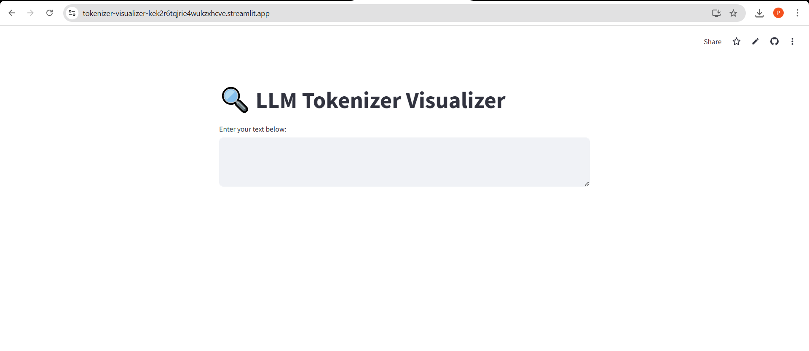
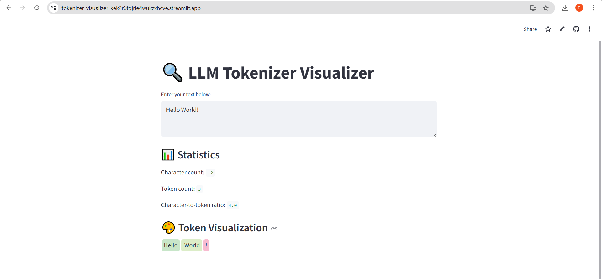
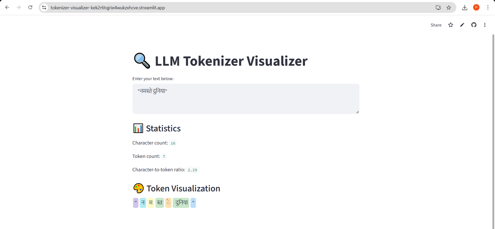

# 🔍 LLM Tokenizer Visualizer

A Streamlit-based web application that visualizes how Large Language Models (LLMs) process text into tokens using OpenAI’s `tiktoken` tokenizer.

---

## 🚀 Live Demo
https://tokenizer-visualizer-kek2r6tqjrie4wukzxhcve.streamlit.app/

---

## 📖 Project Overview

LLMs do not read text as words — they process text as **tokens** (numerical representations of word pieces).

This project helps visualize:

- How text is split into tokens
- Token count
- Character-to-token ratio
- How tokenization differs for English, code, and non-English text
- Why tokenization impacts API billing


## 🛠 Tech Stack

- Python
- Streamlit
- tiktoken (OpenAI tokenizer)


## 📊 Features

- Interactive text input
- Token count calculation
- Character-to-token ratio analysis
- Color-coded token visualization
- Works for:
  - English text
  - Code snippets
  - Non-English languages

---

## 🧠 Why This Matters

OpenAI API pricing is based on token usage.

Understanding tokenization helps:

- Optimize prompts
- Reduce API cost
- Improve performance
- Handle multilingual inputs effectively

---

## 🖼 Screenshots

### Home Screen


### Token Visualization


### Non-English Tokenization



## 📦 Installation (Run Locally)

```bash
pip install streamlit tiktoken
streamlit run app.py
